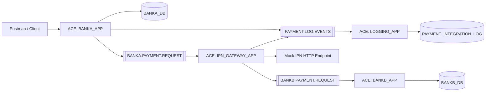

# Mock Instant Payment Network — IBM ACE, IBM MQ, SQL Server

An educational banking middleware simulation that demonstrates an asynchronous payment flow between two mock banks using IBM App Connect Enterprise (ACE), IBM MQ, Microsoft SQL Server, and a mock IPN HTTP endpoint.

> Educational simulation only. This repository does not represent Egypt's real IPN infrastructure or any private banking implementation.

## Features

- Bank A payment initiation API over HTTP/JSON
- Validation and source-account checks
- Idempotency handling: new, duplicate replay, and conflict
- SQL-side duplicate protection before debit
- Bank A debit persistence
- IBM MQ asynchronous routing
- Mock IPN HTTP integration
- Bank B credit processing
- Single `transactionId` for end-to-end tracking
- One-row asynchronous integration logging
- Backout queues, dead-letter queue, and poison-message protection
- Clean client-facing Bank A response

## Final architecture

## Verified status

| Capability | Status |
|---|---|
| End-to-end payment | PASS |
| Bank A debit | PASS |
| IBM MQ routing | PASS |
| Mock IPN integration | PASS |
| Bank B credit | PASS |
| Async audit logging | PASS |
| Single transactionId | PASS |
| Duplicate idempotency | PASS |
| Idempotency conflict | PASS |
| DB double-debit protection | PASS |
| Clean Bank A response | PASS |
| Backout handling | PASS |
| Dead-letter queue | CONFIGURED |
| Poison-message protection | PASS |

## Core applications

- `BANKA_APP`
- `IPN_GATEWAY_APP`
- `BANKB_APP`
- `LOGGING_APP`

## Core queues

- `BANKA.PAYMENT.REQUEST`
- `BANKA.PAYMENT.BACKOUT`
- `BANKB.PAYMENT.REQUEST`
- `BANKB.PAYMENT.BACKOUT`
- `PAYMENT.LOG.EVENTS`
- `PAYMENT.LOG.BACKOUT`
- `IPN.DEAD.LETTER.QUEUE`

## Quick start

1. Run the SQL scripts in `sql/`.
2. Run `mq/setup-queues.mqsc` against `QM_IPN_LAB`.
3. Configure the ODBC DSNs from `docs/odbc-setup.md`.
4. Copy/export the four ACE applications into `ace/`.
5. Import the Postman collection.
6. Run `sql/06_final_verification.sql`.
