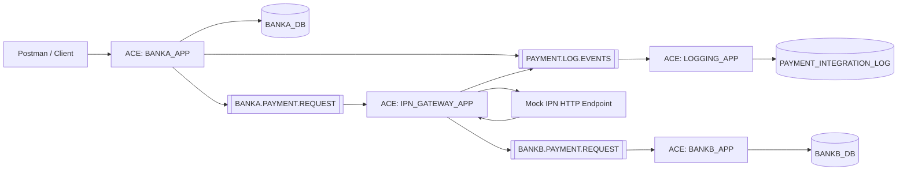

# Mock Instant Payment Network — IBM ACE, IBM MQ, SQL Server

An educational banking middleware simulation that demonstrates an asynchronous payment flow between two mock banks using IBM App Connect Enterprise (ACE), IBM MQ, Microsoft SQL Server, and a mock IPN HTTP endpoint.

> Educational simulation only. This repository does not represent Egypt's real IPN infrastructure or any private banking implementation.

## Technology stack

- IBM App Connect Enterprise 13
- IBM MQ
- Microsoft SQL Server
- ESQL
- ODBC Driver 18 for SQL Server
- Postman
- Postman Mock Server
- JSON

## Features

- Bank A payment initiation API over HTTP/JSON
- Validation and source-account checks
- Idempotency handling: new, duplicate replay, and conflict
- SQL-side duplicate protection before debit
- Bank A debit persistence
- IBM MQ asynchronous routing
- Mock IPN HTTP integration
- Bank B credit processing
- Single `transactionId` for end-to-end tracking
- One-row asynchronous integration logging
- Backout queues
- Dead-letter queue configuration
- Poison-message protection
- Clean client-facing Bank A response

## Final architecture



## Payment flow

```text
Postman / Client
      |
      v
BANKA_APP
      |
      +--> Validate payment
      |
      +--> Check source account
      |
      +--> Check idempotency
      |
      +--> Debit Bank A account
      |
      +--> Persist Bank A transaction
      |
      +--> Send asynchronous log events
      |
      v
BANKA.PAYMENT.REQUEST
      |
      v
IPN_GATEWAY_APP
      |
      +--> Build Mock IPN request
      |
      +--> Send asynchronous log events
      |
      v
Postman Mock IPN
      |
      v
IPN_GATEWAY_APP
      |
      +--> Process Mock IPN response
      |
      +--> Log response
      |
      v
BANKB.PAYMENT.REQUEST
      |
      v
BANKB_APP
      |
      +--> Check duplicate payment
      |
      +--> Credit destination account
      |
      +--> Persist Bank B transaction
      |
      v
BANKB_DB
```

## Verified status

| Capability | Status |
|---|---|
| End-to-end payment | PASS |
| Bank A debit | PASS |
| IBM MQ routing | PASS |
| Mock IPN integration | PASS |
| Bank B credit | PASS |
| Async audit logging | PASS |
| Single `transactionId` | PASS |
| Duplicate idempotency | PASS |
| Idempotency conflict | PASS |
| DB double-debit protection | PASS |
| Clean Bank A response | PASS |
| Backout handling | PASS |
| Dead-letter queue | CONFIGURED |
| Poison-message protection | PASS |

## Core applications

The project contains four IBM ACE applications:

```text
BANKA_APP
IPN_GATEWAY_APP
BANKB_APP
LOGGING_APP
```

### BANKA_APP

Responsible for:

- Receiving payment requests over HTTP
- Request validation
- Source-account validation
- Idempotency checks
- Transaction ID generation
- Bank A debit processing
- Sending payment messages to IBM MQ
- Sending asynchronous integration log events
- Returning the client response

### IPN_GATEWAY_APP

Responsible for:

- Consuming Bank A payment messages
- Building the Mock IPN HTTP request
- Calling the Postman Mock Server
- Processing Mock IPN responses
- Logging gateway request/response events
- Forwarding accepted payments to Bank B
- Handling Mock IPN HTTP failures

### BANKB_APP

Responsible for:

- Consuming Bank B payment messages
- Duplicate transaction protection
- Destination-account processing
- Crediting the Bank B account
- Persisting Bank B transactions

### LOGGING_APP

Responsible for:

- Consuming asynchronous log events
- Writing all payment lifecycle events into one integration log row
- Updating logs using the payment `transactionId`

## Core IBM MQ queues

```text
BANKA.PAYMENT.REQUEST
BANKA.PAYMENT.BACKOUT

BANKB.PAYMENT.REQUEST
BANKB.PAYMENT.BACKOUT

PAYMENT.LOG.EVENTS
PAYMENT.LOG.BACKOUT

IPN.DEAD.LETTER.QUEUE
```

Queue manager:

```text
QM_IPN_LAB
```

Backout threshold:

```text
3
```

## Database structure

The project uses two SQL Server databases:

```text
BANKA_DB
BANKB_DB
```

### BANKA_DB

Main tables:

```text
CUSTOMERS
ACCOUNTS
PAYMENT_TRANSACTIONS
PAYMENT_INTEGRATION_LOG
```

The integration log stores the payment lifecycle in one row identified by:

```text
transaction_id
```

It includes:

- inbound request
- inbound request timestamp
- Bank A response
- Bank A response timestamp
- Mock IPN request
- Mock IPN request timestamp
- Mock IPN response
- Mock IPN response timestamp
- final response
- final response timestamp
- status
- error code
- error message
- error timestamp

### BANKB_DB

Main tables:

```text
CUSTOMERS
ACCOUNTS
PAYMENT_TRANSACTIONS
```

## Idempotency

The API uses:

```text
idempotencyKey
```

to prevent duplicate payment processing.

Three scenarios are supported.

### New payment

A previously unused key is processed normally.

```json
{
  "sourceAccount": "A001",
  "destinationBank": "BANKB",
  "destinationAccount": "B001",
  "amount": 1,
  "currency": "EGP",
  "idempotencyKey": "IDEMP-FINAL-001"
}
```

### Duplicate replay

Submitting the same payment using the same idempotency key returns the existing transaction.

Example response:

```json
{
  "success": true,
  "continueProcessing": false,
  "duplicate": true,
  "transactionId": "TXN-EXAMPLE",
  "idempotencyKey": "IDEMP-FINAL-001",
  "status": "DEBITED",
  "amount": 1.00,
  "currency": "EGP",
  "message": "Duplicate idempotency key; existing transaction returned"
}
```

No second debit or Bank B credit should occur.

### Idempotency conflict

Reusing the same idempotency key with different payment data returns:

```json
{
  "success": false,
  "continueProcessing": false,
  "duplicate": false,
  "idempotencyKey": "IDEMP-FINAL-001",
  "error": {
    "code": "IDEMPOTENCY_CONFLICT",
    "message": "Idempotency key already used for a different payment"
  }
}
```

This educational implementation currently returns HTTP `200` for this business-level conflict.

## Example successful response

```json
{
  "success": true,
  "transactionId": "TXN-EXAMPLE",
  "idempotencyKey": "IDEMP-FINAL-001",
  "sourceAccount": "A001",
  "destinationBank": "BANKB",
  "destinationAccount": "B001",
  "amount": 1,
  "currency": "EGP",
  "status": "DEBITED",
  "message": "Payment accepted and Bank A debit completed"
}
```

## Reliability

The project includes:

- Asynchronous IBM MQ messaging
- Backout queues
- Retry threshold handling
- Dead-letter queue configuration
- Poison-message protection
- Bank B duplicate protection
- Bank A SQL-level duplicate protection
- Idempotent client requests

Configured backout queues:

```text
BANKA.PAYMENT.BACKOUT
BANKB.PAYMENT.BACKOUT
PAYMENT.LOG.BACKOUT
```

Configured dead-letter queue:

```text
IPN.DEAD.LETTER.QUEUE
```

## Repository structure

```text
Mock-IPN-Final/
│
├── README.md
├── START_HERE.md
├── RUNBOOK.md
├── PROJECT_STATUS.md
├── .gitignore
│
├── ace/
│   ├── BANKA_APP/
│   ├── BANKB_APP/
│   ├── IPN_GATEWAY_APP/
│   ├── LOGGING_APP/
│   └── README.md
│
├── sql/
│   ├── 00_CREATE_DATABASES.sql
│   ├── 01_BANKA_DB.sql
│   ├── 02_BANKB_DB.sql
│   ├── 03_LOGGING.sql
│   ├── 04_STORED_PROCEDURES.sql
│   ├── 05_SEED_DATA.sql
│   ├── 06_final_verification.sql
│   └── README.md
│
├── mq/
│   ├── setup-queues.mqsc
│   └── README.md
│
├── postman/
│   ├── IPN_MOCK_PROJECT.postman_collection.json
│   ├── mock-ipn-success-response.json
│   └── README.md
│
└── docs/
    ├── architecture.md
    ├── database-schema.md
    ├── flow-description.md
    ├── mock-server-setup.md
    ├── odbc-setup.md
    ├── reliability-and-error-handling.md
    ├── source-audit.md
    ├── testing-evidence.md
    └── screenshots/
```

## Quick start

### 1. Install prerequisites

Install:

- IBM App Connect Enterprise 13
- IBM MQ
- Microsoft SQL Server
- Microsoft SQL Server Management Studio
- Microsoft ODBC Driver 18 for SQL Server
- Postman

### 2. Create the databases

Run:

```text
sql/00_CREATE_DATABASES.sql
```

Then run the following scripts in order:

```text
sql/01_BANKA_DB.sql
sql/02_BANKB_DB.sql
sql/03_LOGGING.sql
sql/04_STORED_PROCEDURES.sql
sql/05_SEED_DATA.sql
```

Do not run:

```text
sql/06_final_verification.sql
```

until after the environment has been configured and tested.

### 3. Create/start the IBM MQ queue manager

Queue manager:

```text
QM_IPN_LAB
```

Example:

```cmd
crtmqm QM_IPN_LAB
strmqm QM_IPN_LAB
```

Then run:

```text
mq/setup-queues.mqsc
```

against:

```text
QM_IPN_LAB
```

### 4. Configure ODBC

Follow:

```text
docs/odbc-setup.md
```

Required 64-bit System DSNs:

```text
BANKA_DSN
BANKB_DSN_NOENC
```

Database mapping:

```text
BANKA_DSN
    |
    v
BANKA_DB
```

```text
BANKB_DSN_NOENC
    |
    v
BANKB_DB
```

### 5. Import IBM ACE applications

Import the four applications from:

```text
ace/
```

into IBM ACE Toolkit:

```text
BANKA_APP
BANKB_APP
IPN_GATEWAY_APP
LOGGING_APP
```

### 6. Configure the Mock IPN

Follow:

```text
docs/mock-server-setup.md
```

Configure your own Postman Mock Server endpoint in the IPN Gateway.

The repository does not depend on the original developer's private mock URL.

Expected mock success response:

```json
{
  "success": true,
  "networkStatus": "ACCEPTED",
  "message": "Payment accepted by Mock IPN"
}
```

### 7. Import the Postman collection

Import:

```text
postman/IPN_MOCK_PROJECT.postman_collection.json
```

### 8. Deploy the ACE applications

Deploy:

```text
BANKA_APP
IPN_GATEWAY_APP
BANKB_APP
LOGGING_APP
```

### 9. Test the payment API

Endpoint:

```text
POST http://localhost:7801/api/v1/payments
```

Example request:

```json
{
  "sourceAccount": "A001",
  "destinationBank": "BANKB",
  "destinationAccount": "B001",
  "amount": 1,
  "currency": "EGP",
  "idempotencyKey": "IDEMP-TEST-001"
}
```

### 10. Verify the result

Verify:

- Bank A account was debited
- Bank A transaction exists once
- Bank B account was credited
- Bank B transaction exists once
- integration log exists
- payment queues return to depth `0`

Then run:

```text
sql/06_final_verification.sql
```

## Documentation

Additional documentation is available in:

```text
docs/
```

Including:

- architecture
- database schema
- ACE flow descriptions
- ODBC configuration
- Mock IPN setup
- reliability and error handling
- testing evidence
- screenshots

## Security note

This project is designed for local educational use.

The local lab may use simplified settings such as:

```text
Encrypt=Optional
TrustServerCertificate=Yes
```

These settings should not be copied directly into a production banking environment.

Production environments should use:

- trusted TLS certificates
- encrypted database connections
- secure credential management
- authenticated and encrypted middleware channels
- proper secret management
- enterprise monitoring and access control

## Disclaimer

This project is an educational simulation designed to demonstrate banking middleware concepts using IBM ACE, IBM MQ, SQL Server, and Postman.

It is not connected to Egypt's real Instant Payment Network and does not claim to reproduce any confidential or proprietary banking infrastructure.
