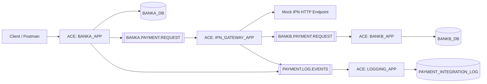

# Architecture

```mermaid
flowchart LR
    Client[Client / Postman]
    BankA[ACE: BANKA_APP]
    BankADB[(BANKA_DB)]
    QBankA[[BANKA.PAYMENT.REQUEST]]
    Gateway[ACE: IPN_GATEWAY_APP]
    Mock[Mock IPN HTTP Endpoint]
    QBankB[[BANKB.PAYMENT.REQUEST]]
    BankB[ACE: BANKB_APP]
    BankBDB[(BANKB_DB)]
    QLog[[PAYMENT.LOG.EVENTS]]
    Logger[ACE: LOGGING_APP]
    LogDB[(PAYMENT_INTEGRATION_LOG)]

    Client --> BankA
    BankA --> BankADB
    BankA --> QBankA
    BankA --> QLog
    QBankA --> Gateway
    Gateway --> Mock
    Gateway --> QLog
    Gateway --> QBankB
    QBankB --> BankB
    BankB --> BankBDB
    QLog --> Logger
    Logger --> LogDB
```

The project uses one `transactionId` as the primary end-to-end tracking identifier.
